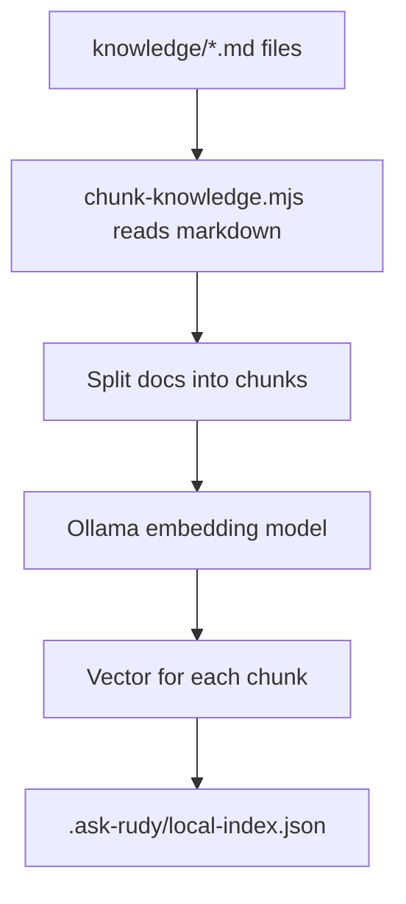
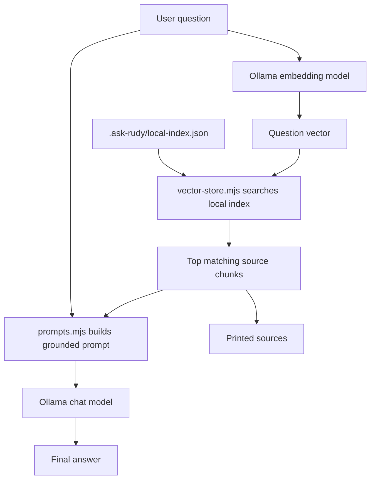

# Ask Rudy Local RAG Explainer

This document explains the local Phase 1 pipeline in plain language.

The most important idea:

```txt
Ollama does model work.
Our scripts do retrieval-system work.
```

Ollama is not automatically reading the repo, chunking markdown, choosing sources, or searching a database. Our code does those parts.

## The Pieces

```txt
knowledge/*.md
  The source facts about Rudy.

scripts/ask-rudy/chunk-knowledge.mjs
  Reads markdown and splits it into searchable chunks.

Ollama embedding model
  Turns each chunk into a vector, which is a list of numbers representing meaning.

.ask-rudy/local-index.json
  Stores chunks plus their vectors.

scripts/ask-rudy/vector-store.mjs
  Searches the local index with cosine similarity.

scripts/ask-rudy/prompts.mjs
  Builds the instruction prompt using the retrieved chunks.

scripts/ask-rudy/run-query.mjs
  Reuses the same ask/fit pipeline for one-off questions and evals.

Ollama chat model
  Writes the final answer from the prompt and context.
```

## Mental Model

Imagine each knowledge chunk gets a coordinate on a meaning map.

When you ask a question, the question also gets a coordinate.

The retrieval step asks:

```txt
Which chunks are closest to this question on the meaning map?
```

Then the answer step asks:

```txt
Given only these closest chunks, write a helpful answer.
```

## Indexing Flow

Indexing is the offline prep step. Run it whenever knowledge files change.

Command:

```bash
npm run ask-rudy:index
```

Flow:



What our code does:
- Finds markdown files.
- Reads frontmatter metadata.
- Splits documents into chunks.
- Saves chunks and embeddings to `.ask-rudy/local-index.json`.

What Ollama does:
- Takes chunk text.
- Returns an embedding vector.

## Provider Boundaries

The local lab now runs through two explicit provider boundaries:

- `ASK_RUDY_MODEL_PROVIDER=ollama`
  - embeds chunks and questions
  - generates the final answer from the grounded prompt
- `ASK_RUDY_RETRIEVAL_PROVIDER=local-json`
  - writes `.ask-rudy/local-index.json`
  - searches the generated local index

Cloudflare Workers AI and Upstash Vector are intentionally stubbed for the next production MRs. Selecting those providers now returns a clear setup error instead of silently making hosted calls.

## Asking Flow

Asking is the online question-answering step.

Command:

```bash
npm run ask-rudy:ask -- "What kind of engineer is Rudy?"
```

Flow:



What our code does:
- Embeds the question by asking Ollama.
- Searches the local index.
- Picks the top matching chunks.
- Builds a prompt containing the question and retrieved chunks.
- Prints the final answer and the sources used.

What Ollama does:
- Turns the question into an embedding vector.
- Generates the final answer from the prompt.

## Role Match Flow

Role Match uses the same retrieval pipeline as Coffee Chat. The difference is the prompt.

Command:

```bash
npm run ask-rudy:fit -- "We need a product-minded AI platform engineer."
```

Coffee Chat asks:

```txt
Answer this question warmly and conversationally from the retrieved context.
```

Role Match asks:

```txt
Evaluate this role against the retrieved context. Include strong matches and gaps.
```

Same data. Same vector search. Different task framing.

## File Map

```txt
scripts/ask-rudy/config.mjs
  Shared paths, model names, chunk settings, and retrieval settings.

scripts/ask-rudy/chunk-knowledge.mjs
  Turns markdown files into searchable chunks.

scripts/ask-rudy/ollama-provider.mjs
  Talks to Ollama for embeddings and chat generation.

scripts/ask-rudy/providers/model-provider.mjs
  Chooses the model provider: Ollama for local, Cloudflare embeddings for production indexing.

scripts/ask-rudy/providers/retrieval-provider.mjs
  Chooses the retrieval provider: local JSON for local, Upstash Vector for production indexing.

scripts/ask-rudy/vector-store.mjs
  Saves, loads, and searches the local vector index.

scripts/ask-rudy/prompts.mjs
  Builds Coffee Chat and Role Match prompts.

scripts/ask-rudy/run-query.mjs
  Runs the shared query pipeline: embed input, search index, build prompt, generate answer.

scripts/ask-rudy/build-index.mjs
  CLI entrypoint for npm run ask-rudy:index.

scripts/ask-rudy/ask.mjs
  CLI entrypoint for npm run ask-rudy:ask and npm run ask-rudy:fit.

scripts/ask-rudy/eval.mjs
  CLI entrypoint for npm run ask-rudy:eval.

evals/ask-rudy-cases.json
  Starter eval questions and human-readable checks.

src/app/api/ask-rudy/route.ts
  Local-only website API route that calls the same query pipeline.
```

## Glossary

### Chunk

A small piece of a source document. Instead of sending the whole resume every time, we search smaller pieces and send the most relevant ones.

### Embedding

A list of numbers that represents the meaning of text. Similar text should produce vectors that are close together.

### Vector Search

Search that compares embeddings instead of exact words.

### Cosine Similarity

The math we use to compare two vectors. Higher score means "more similar."

### RAG

Retrieval-Augmented Generation.

In Ask Rudy, that means:

```txt
retrieve relevant chunks first
then generate an answer from those chunks
```

### Prompt

The instructions and context we send to the chat model.

## Why This Matters

This setup is useful because facts stay in markdown files, not hidden inside a trained model.

When Rudy's resume or projects change:

1. Update `knowledge/*.md`.
2. Run `npm run ask-rudy:index`.
3. Ask questions again.

No training step is required for Phase 1.
